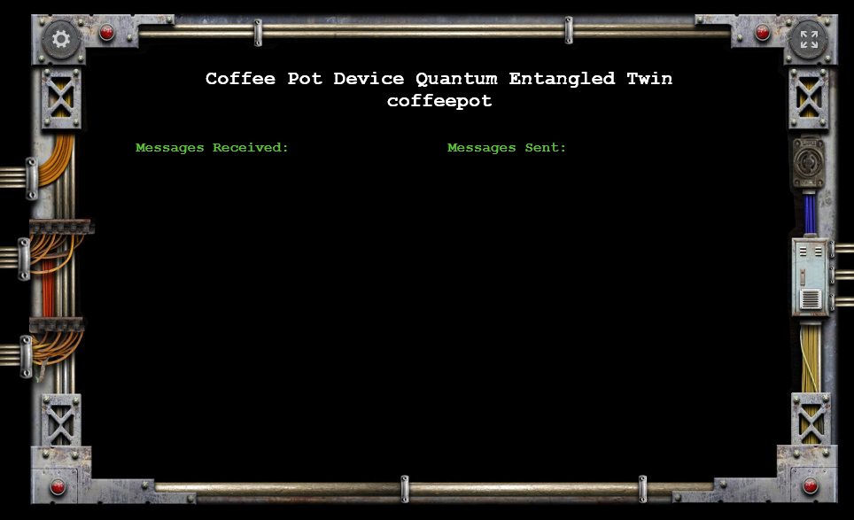

# MISSION GOAL : ESTABLISH A CONNECTION

The crew is lost, out of contact with Earth, but they haven’t gone completely dark. We’re picking up some weak signals. Indications that there are still devices running on Mars.

One of those signals is coming from the crew’s living quarters… it appears to be… a coffee pot. Like all remote devices on Mars, it connects using Azure IoT Hubs, and in this case a command set inspired by the Hypertext Coffee Pot Control Protocol (HTCPCP/v1.0, <a target="_blank" href="https://aka.ms/rfc2324">RFC 2342</a> - <a target="_blank" href="https://aka.ms/rfc2324">https://aka.ms/rfc2324</a>).

Now we have a target, let’s get to work. First, you’ll ramp up your core skills on Azure IoT Hubs, then you’ll attempt to establish communications with the coffee pot. Good luck, and good coffee.

____

## CORE SKILL TRAINING

Before you can successfully communicate with the devices, you must first master core Azure IoT Hub skills.  To prepare, first complete the following **two** exercises:

> **Note**: Even if you are working in teams, it is recommended that each team member complete the core skill training exercises.  This will make sure that the entire team is ready to accomplish the Mission Objectives.

- For **.NET Developers**, complete ***both of the following walkthroughs***:
    1. "<a target="_blank" href="https://aka.ms/mars-iot-cs-01">Get started with Azure IoT Hub for .NET</a>" - <a target="_blank" href="https://aka.ms/mars-iot-cs-01">https://aka.ms/mars-iot-cs-01</a>

    1. "<a target="_blank" href="https://aka.ms/mars-iot-cs-02">How to send cloud-to-device messages with IoT Hub and .Net</a>" - <a target="_blank" href="https://aka.ms/mars-iot-cs-02">https://aka.ms/mars-iot-cs-02</a>


- For **Node.js Developers**, complete ***both of the following walkthroughs***:

    1. "<a target="_blank" href="https://aka.ms/mars-iot-js-01">Get started with Azure IoT Hub for Node.js</a>" - <a target="_blank" href="https://aka.ms/mars-iot-js-01">https://aka.ms/mars-iot-js-01</a>

    1. "<a target="_blank" href="https://aka.ms/mars-iot-js-02">How to send cloud-to-device messages with IoT Hub and Node.js</a>" - <a target="_blank" href="https://aka.ms/mars-iot-js-02">https://aka.ms/mars-iot-js-02</a>

____

## MISSION OBJECTIVES

The main objective of this mission is to establish IoT Hub communications with the coffee pot on Mars. You will be working as a part of a team on this objective.

Using a top-secret technology called "_Quantum Entanglement_", your on-site Earth-Mars Bridge (EMB) mission leads are running a "twin" of the coffee pot code.  Whatever communications you have with the coffee pot on the Mars base will be reflected in the on-premises twin displayed on the projector in the room.  You can use the output of the twin to verify the information you gather from your own code.



Using the skills you mastered in the training, your next task is to accomplish the following objectives:

1. Retrieve your team name from your on site EMB Specialists
2. Monitor messages from the coffee pot
3. Ping the coffee pot
4. Brew some coffee!

### Objective 1: Retrieve Your Team Name

With so many signals bouncing between Earth and Mars, we’ll need careful coordination. Collect your assigned team name from the Mission Control team in the room. It will look something like this:


The name displayed on your card is your team name. You must use that name on all communications with Mars to prevent any crosstalk or confusion.

### Objective 2: Monitor messages from the coffee pot

Before we send any commands to the coffee pot, we first need to make sure that we are setup to monitor the messages it sends back.

In the tutorial above you created an IoT Hub in your own Azure subscription, and a Device Identity that you could simulate and send and receive messages with.  The coffee pot on Mars however is an ALREADY EXISTING device in an IoT Hub created by the Mission Mars team.  You will need to modify your code to communicate with OUR IoT Hub and coffee pot device rather than YOUR IoT Hub and your simulated device.

You will need to modify the code you created above to monitor messages on the space station's IoT Hub, and to listen specifically for messages from the coffee pot.  To do that, you will need the following information:

| Item | Value |
| ---- | ----- |
| Coffee Pot Device ID | `coffeepot` |
| coffeeclient Connection String | Ask your on-site EMB Mission Specialist for the URL to copy the coffeeclient connection string from |
| Team Number | The "teamxx" name retrieved above |

Use the information above to modify the code in the "**Receive device-to-cloud messages**" task of core skills exercise as follows:

1. Locate the code:

    - For **.NET** it's in the `ReadDeviceToCloudMessages\Program.cs` file, unless you named the project something different.

    - For **Node.js** it's in the `readdevicetocloudmessages\ReadDeviceToCloudMessages.js` file unless you named the folder or file something different.

1. Use the URL provided by your local EMB Mission Specialist to copy the "**coffeeclient Connection String**" needed to connect to the Mars IoT Hub.  Open the file at that URL, and copy the connection string from there.

1. Use the "**coffeeclient Connection String**" copied  above as the value of the `connectionString` variable.  

    > **Note**: The "**coffeeclient**" SAS Policy on the IoT Hub has "**Service Connect**" permissions. This means that it can connect to the "service" side (not the device side) of the Azure IoT Hub.  It can the listen for "device-to-cloud" messages from the device, or send "cloud-to-device" messages to the device.

    - For **.NET**:

        ```c#
        static string connectionString = "HostName=marsiotxxx...;SharedAccessKeyName=coffeeclient;SharedAccessKey=...=";
        ```

    - For **Node.js**:

        ```js
        var connectionString = 'HostName=marsiotxxx...;SharedAccessKeyName=coffeeclient;SharedAccessKey=...=';
        ```

1. Use a specific consumer group for your team.  Your consumer group name is your `teamxx` (all lower case) team name you retrieved previously

    > **Note**: Each "Consumer Group" on an event hub gets its own view of the stream of messages in the event hub.  By using a consumer group that is unique to your team, you ensure that you don't conflict with other teams that may be reading messages at the same time.

    1. For the **.NET** code, replace:

         `eventHubClient.GetDefaultConsumerGroup()`

         with

         `eventHubClient.GetConsumerGroup("teamxx")`

    1. For **Node.js**, replace: 

        The `'$Default'` consumer group name

        with

        your `'teamxx'` team name.

1. Once you have completed the modifications, run the **"ReadDeviceToCloudMessages"** (.NET or Node.js) application to begin listening for messages on the `marsiot` iot hub. If we can get the coffee pot talking, this is where we'll see the messages it sends.  Keep it running to view the responses from the next steps.


### Objective 3: Ping the coffee pot

Now that you are ready to receive messages from the coffee pot, you can attempt to send a message to the coffee pot.

You will use the same connection information provided above.

***Coffee Pot Cloud-to-Device Message Format***

The coffee pot expects messages to be sent to it in a specific format: 

```json
{
  "Command":"",
  "Team":"",
  "Parameters":""
}
```

You do ***not*** have to send the command as multiple lines.  It will likly be easier to compact it down to one line:

```json
{"Command":"","Team":"","Parameters":""}
```

Finally, in C#, to include double quotes within a string literal you can escape the double quote with a backslash.  For example:

```c#
string message = "{\"Command\":\"\",\"Team\":\"\",\"Parameters\":\"\"}";
```

***Coffee Pot Device-to-Cloud Message Format***

When the coffee pot on mars receives a message and has completed processing it, it will respond with a message in the following format:

```json
{
  "SentAt": "",
  "Team": "",
  "MessageText":""
}
```

Again, in a single line it might look like:

```json
{"SentAt": "","Team": "","MessageText":""}
```

Following are the details for the "**Ping**" command

| Command | Team | Parameters | Response |
| --- | --- | --- | --- |
| **Ping** | Your `teamxx` team name | Any string payload you would like to send | A coffee pot "Device-to-Cloud" message will be sent with the `MessageText` being "Ping Response: ", and your message's `Parameters` value. |

To ping the coffee pot:

1. Locate the code you created in the **"Send Cloud-to-Device Message"** task of the core skill exercises

    a. For **.NET**, the code is in the `SendCloudToDevice/program.cs` file unless you named your project something else.

    b. For **Node.js**, it is in the `SendCloudToDeviceMessage.js` file unless you named the file something else.

2. Use the "**coffeeclient Connection String**" from above for the value of the `connectionString` variable.

    - For **.NET**:

        ```c#
        static string connectionString = "HostName=marsiotxxx...;SharedAccessKeyName=coffeeclient;SharedAccessKey=...=";
        ```

    - For **Node.js**:

        ```js
        var connectionString = 'HostName=marsiotxxx...;SharedAccessKeyName=coffeeclient;SharedAccessKey=...=';
        ```

3. Use the `coffeepot` device id for the target device instead of the `myFirstDevice` (for .NET) or `myFirstNodeDevice` (for Node.js).

4. Modify the `commandMessage` (For .NET) or the `message` (For Node.js) variable to be a `Message` object with the contents being a string that matches the message "**Coffee Pot Cloud-to-Device Message Format**" described above, and with appropriate values for the "**Ping**" command. 

5. Run the `SendCloudToDevice` (.NET) or `SendCloudToDeviceMessage.js` program to send the ping command to the coffee pot. Repeat the execution to send the command again.

6. Monitor the output of the `ReadDeviceToCloudMessages` from the previous step to see the response.

### Objective 4: Brew some coffee!

Congratulations! If you have gotten this far, you have successfully established communications with the coffee pot on Mars! Finally, let's try to get the crew's attention by brewing the coffee.

Here are the details for the "**Brew**" command:

| Command | Team | Parameters | Response |
| --- | --- | --- | --- |
| **Brew** | Your `teamxx` team name | An empty string | A coffee pot "Device-to-Cloud" message will be sent with the `MessageText` of "Brewing Coffee!". |

To brew coffee:

1. Using the same "**Coffee Pot Cloud-to-Device Message Format**" as you did with the "**Ping**" command, modify the code you just used to use the "**Brew**" command instead.
2. Run the `SendCloudToDevice` (.NET) or `SendCloudToDeviceMessage.js` program to send the message to the coffee pot. Repeat the execution to send the command again.
3. Again, monitor the output in the `ReadDeviceToCloudMessages` program.